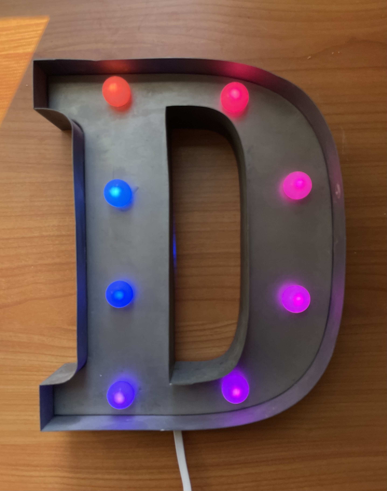

# BigLetterD

While perusing a local merchant's sale table I spotted a metal "D" art piece with basic white LEDs illuminating the inner portion of the 'D' itself.  Given that my name is "David" and my consulting business is "Disquiry, LLC" I couldn't pass it up.  My idea at the time was to replace the basic while LEDs with Neopixel smart LEDs and conceal a small Arduino controller behind the main body of the 'D' to power them.

## Physical Assembly
Removing the existing white LEDs and battery pack was easy enough.  That left a set of frosted white plastic domes on the front of the 'D', which the LEDs had previously shone through, as the locations for Neopixel replacements.  I initially experimented with individual Neopixels but discovered I could more easily insert and connect if I started with a pre-wired [Neopixel strand](https://www.adafruit.com/product/3631), which could be cut to any length and give me the eight I needed.  

An [ESP32 V2 Feather](https://www.adafruit.com/product/5438) provided the controller, which I could fit inside the back of the 'D' and power with a flat USB-C cable.

## Software
The Arduino sketch makes use of my [LED Control library](https://github.com/disquisitioner/LEDControl), which itself builds on the [FastLED library](https://github.com/FastLED/FastLED), simplifying animation of the Neopixels.  I'm currently running the BigLetterD_v2 sketch, which regularly cyles through a rich set of animations that I think look good in the short (eight Neopixel) strip in the 'D'.